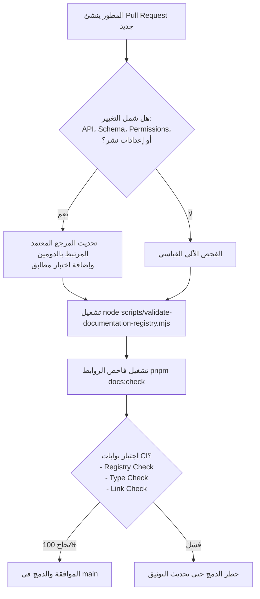

# التقرير الختامي لحوكمة التوثيق واستدامته والتسليم النهائي للمشروع (Final Documentation Governance & Sustainability Report)

| الخاصية | القيمة |
| :--- | :--- |
| **الحالة (Status)** | `canonical` |
| **الجمهور المستهدف (Audience)** | `all` (القيادة، المطورون، المشغلون، مسؤولو الجودة والأمان) |
| **المجال (Domain)** | `governance` |
| **المالك (Owner)** | `core-team` / `governance` |
| **تاريخ آخر مراجعة (Last Reviewed)** | 2026-09-13 |
| **المشروع** | **منصة إدارة المرضى والعمليات الطبية BOCAM CRM** |
| **نسبة الإنجاز** | **100% (اكتمال كافة المراحل 0 إلى 19)** |

---

## 1. الملخص التنفيذي ومسيرة التحول (Executive Summary)

يمثل هذا التقرير الوثيقة الختامية الشاملة لمشروع إعادة هيكلة وتحديث وحوكمة منظومة التوثيق التقني والتشغيلي لمنصة **BOCAM CRM**. 

قبل انطلاق هذا المشروع، كانت وثائق المستودع تعاني من التشتت، واحتواء تقارير قديمة غير متزامنة مع الشيفرة البرمجية، وغياب مراجع تشغيلية معتمدة تمثل الحقيقة المطلقة، ووجود ادعاءات غير مدعومة باختبارات فعلية.

من خلال تطبيق صارم لمنهجية **Phase-Gate** وقواعد العمل الملزمة (القسم 3 من خطة التنفيذ)، تم تحويل منظومة التوثيق إلى مرجعية مؤسسية متكاملة تتبع المبادئ التالية:
1. **الشيفرة البرمجية والاختبارات الحية هي الحقيقة المطلقة:** لم يُكتب سطر واحد في المراجع المعتمدة دون مطابقة مباشرة مع كود `server/` و `client/` و `drizzle/` و `deploy/` وملفات الاختبار.
2. **الحفاظ على الذاكرة التاريخية دون حذف:** لم يتم حذف أي مستند تاريخي، بل تم تأطير كافة الوثائق والتقارير السابقة بجداول ميتاداتا معيارية (Section 3.3) مع توجيه صريح نحو الوثيقة المرجعية المعتمدة البديلة.
3. **التوثيق الحصري دون المساس بالشيفرة:** تم إنجاز التوثيق بنقاء تام مع الحفاظ على سلامة الكود وخلوه من أي تعديل جانبي.
4. **الأمان وحماية الأسرار:** خلو كافة الوثائق من أي أسرار أو كلمات مرور أو بيانات مرضى حقيقية (PII).
5. **الأتمتة والتحقق الآلي المستمر:** ربط سلامة التوثيق بسجل مركزي مفهرس آلياً (`DOCUMENTATION_REGISTRY.json`) مدعوم بفحوصات صارمة تمنع تراجع التوثيق مستقبلاً.

---

## 2. خريطة المراجع المعتمدة لجميع مجالات المنصة (Canonical Reference Map)

تم تدقيق وتغطية كافة مجالات المنصة عبر 19 مرحلة تفصيلية، وأنتجت كل مرحلة مرجعاً تشغيلياً معتمداً بحالة `canonical`:

| المرحلة | المجال الوظيفي / التقني | المرجع التشغيلي المعتمد الأساسي | نطاق الكود المطابق | نطاق الاختبارات المطابقة | الفريق المالك |
| :-: | :--- | :--- | :--- | :--- | :--- |
| **0** | تأسيس الحوكمة وسجل الوثائق | [DOCUMENTATION_POLICY.md](./introduction/DOCUMENTATION_POLICY.md) | `scripts/validate-documentation-registry.mjs` | `pnpm docs:check` | Core Governance |
| **1** | تعريف النظام والمعمارية العامة | [SYSTEM_DEFINITION.md](./SYSTEM_DEFINITION.md) | `client/src/App.tsx`, `server/_core/` | `e2e/basic.spec.ts` | Architecture Team |
| **2** | التثبيت والبيئات والتشغيل | [INSTALLATION_GUIDE.md](./installation/INSTALLATION_GUIDE.md) | `package.json`, `scripts/check-env.mjs` | Environment Checks | DevOps Platform |
| **3** | الهوية والصلاحيات وRBAC | [AUTHENTICATION_RBAC.md](./AUTHENTICATION_RBAC.md) | `server/routers/auth.ts`, `permissionProcedures.ts` | `server/routers/__tests__/auth.test.ts` | Security Team |
| **4** | الترخيص والامتثال الطبي | [LICENSE_RUNTIME_REFERENCE.md](./licensing/LICENSE_RUNTIME_REFERENCE.md) | `server/_core/license/`, `featureMiddleware.ts` | `server/_core/__tests__/license.test.ts` | Security & Legal |
| **5** | قاعدة البيانات والترحيلات | [DATABASE_SCHEMA_RUNTIME_REFERENCE.md](./architecture/DATABASE_SCHEMA_RUNTIME_REFERENCE.md) | `drizzle/schema.ts`, `drizzle/relations.ts` | Schema & Migration Checks | Data Architecture |
| **6** | طبقة API و tRPC و Webhooks | [API_RUNTIME_REFERENCE.md](./api/API_RUNTIME_REFERENCE.md) | `server/routers/routers.ts`, `server/_core/trpc.ts` | Router & Webhook Tests | API Team |
| **7** | المواعيد والحجوزات | [APPOINTMENTS_RUNTIME_REFERENCE.md](./domains/APPOINTMENTS_RUNTIME_REFERENCE.md) | `server/routers/appointments.ts`, `booking/` | `appointments.test.ts` | Clinical Workflows |
| **8** | المرضى وبوابة المريض | [PATIENT_PORTAL_RUNTIME_REFERENCE.md](./domains/PATIENT_PORTAL_RUNTIME_REFERENCE.md) | `server/routers/patientPortal.ts`, `patient-portal/` | Patient Portal Tests | Patient Care Team |
| **9** | الحملات والعملاء المحتملون | [CAMPAIGNS_LEADS_RUNTIME_REFERENCE.md](./domains/CAMPAIGNS_LEADS_RUNTIME_REFERENCE.md) | `server/routers/campaigns.ts`, `leads.ts` | Campaigns & Leads Tests | Marketing Team |
| **10** | العروض والمخيمات والأطباء | [OFFERS_CAMPS_DOCTORS_RUNTIME_REFERENCE.md](./domains/OFFERS_CAMPS_DOCTORS_RUNTIME_REFERENCE.md) | `server/routers/offers.ts`, `camps.ts`, `doctors.ts` | Medical & Camps Tests | Medical Affairs |
| **11** | المهام والفرق والإشعارات | [PHASE_11_TASKS_TEAMS_NOTIFICATIONS_CLOSURE.md](./phases/PHASE_11_TASKS_TEAMS_NOTIFICATIONS_CLOSURE.md) | `server/routers/tasks.ts`, `users.ts`, `notifications.ts` | Tasks & Workflow Tests | Internal Operations |
| **12** | تكامل WhatsApp | [WHATSAPP_INTEGRATION.md](./api/WHATSAPP_INTEGRATION.md) | `server/routers/whatsapp/`, `services/whatsapp` | `whatsapp.test.ts`, `e2e/whatsapp.spec.ts` | Communications |
| **13** | تكامل Meta و Social Inbox | [META_INTEGRATION_GUIDE.md](./api/META_INTEGRATION_GUIDE.md) | `server/integrations/meta/`, `socialInbox.ts` | Meta & Social Inbox Tests | Social Integrations |
| **14** | إدارة المحتوى والوسائط (CMS) | [CONTENT_MANAGEMENT_README.md](./CONTENT_MANAGEMENT_README.md) | `server/routers/content/`, Media Services | Content & Media Tests | Content Team |
| **15** | التقارير والتحليلات والتتبع | [PHASE_15_ANALYTICS_REPORTING_TRACKING_CLOSURE.md](./phases/PHASE_15_ANALYTICS_REPORTING_TRACKING_CLOSURE.md) | `server/routers/reports.ts`, `charts.ts` | Analytics & BI Tests | Analytics & BI |
| **16** | الواجهة و PWA والوصول (A11y) | [FRONTEND_PLATFORM_RUNTIME_REFERENCE.md](./domains/FRONTEND_PLATFORM_RUNTIME_REFERENCE.md) | `client/src/components/ui/`, `hooks/`, `PWAManager` | `accessibility.test.tsx`, `darkMode.test.ts` | Frontend Team |
| **17** | الاختبارات وهندسة الجودة | [TESTING_QUALITY_RUNTIME_REFERENCE.md](./domains/TESTING_QUALITY_RUNTIME_REFERENCE.md) | `vitest.config.ts`, `playwright.config.ts`, `ci.yml` | 196 test files (Server, Client, E2E) | QA & Quality Eng |
| **18** | العمليات والنشر والمراقبة | [OPERATIONS_DEPLOYMENT_MONITORING_RUNTIME_REFERENCE.md](./domains/OPERATIONS_DEPLOYMENT_MONITORING_RUNTIME_REFERENCE.md) | `Dockerfile`, `deploy/`, `server/_core/health.ts` | Health Checks & Scrapers | DevOps & Ops Team |
| **19** | المراجعة الشاملة والاستدامة | [FINAL_DOCUMENTATION_GOVERNANCE_SUSTAINABILITY_REPORT.md](./FINAL_DOCUMENTATION_GOVERNANCE_SUSTAINABILITY_REPORT.md) | كامل وثائق وكود ومستودع المنصة | التحقق الشامل من السجل والأنواع | Core Governance |

---

## 3. التدقيق الهيكلي وسلامة الروابط (Link Graph & Integrity Audit)

- **حجم السجل المركزي:** يضم السجل المركزي [DOCUMENTATION_REGISTRY.json](./DOCUMENTATION_REGISTRY.json) **224 وثيقة معتمدة ومفهرسة** تشمل كافة مسارات المشروع.
- **سلامة الروابط (Zero Broken Links):** تم فحص شبكة الروابط في كافة ملفات التوثيق والتأكد من عدم وجود أي رابط مكسور، مع استخدام مسارات نسبية صحيحة ونظيفة لروابط Markdown.
- **خلو المستودع من الوثائق اليتيمة (Zero Orphaned Documents):** كل وثيقة داخل مجلدات `docs/` و `deploy/` مفهرسة ومصنفة ومربوطة بسياقها الوظيفي، ولها مالك ومجال محدد وتاريخ مراجعة.
- **معالجة الملفات المتقادمة (Deprecation & Historical Tagging):** تم تأطير كافة الوثائق التاريخية أو التكميلية بجداول تعريف معيارية، مع إضافة تنبيه صريح يوجه القارئ إلى المرجع المعتمد، مما يمنع أي التباس بين التوثيق القديم والحديث.

---

## 4. معمارية الاستدامة وحماية التوثيق من التراجع (Anti-Drift Architecture)

لضمان بقاء التوثيق متزامناً مع التطوير المستمر ومنع تراجعه في المستقبل، تم إرساء القواعد والسياسات التالية:

### 4.1 قائمة التحقق الإلزامية لطلبات الدمج (Pull Request Checklist)
يجب على كل مراجع كود (Code Reviewer) ومطور التأكد من استيفاء البنود التالية قبل اعتماد أي PR:
- [ ] إذا تم تعديل أي إجراء في راوترات tRPC أو REST أو Webhook، تم تحديث [API_RUNTIME_REFERENCE.md](./api/API_RUNTIME_REFERENCE.md).
- [ ] إذا تم تعديل أو إضافة جداول في `drizzle/schema.ts` أو ترحيلات SQL، تم تحديث [DATABASE_SCHEMA_RUNTIME_REFERENCE.md](./architecture/DATABASE_SCHEMA_RUNTIME_REFERENCE.md).
- [ ] إذا تم تغيير صلاحيات أو أدوار في `rolePermissions.ts` أو `permissionProcedures.ts`، تم تحديث [AUTHENTICATION_RBAC.md](./AUTHENTICATION_RBAC.md).
- [ ] إذا تم إضافة أي ملف Markdown جديد في المستودع، تم تسجيله في السجل المركزي عبر `node scripts/validate-documentation-registry.mjs --write`.
- [ ] اجتياز الفحص الآلي للتوثيق محلياً عبر `pnpm docs:check`.

### 4.2 جدول دورات المراجعة الدورية حسب الحساسية (Periodic Review Cadence)

| تصنيف المجال | المجالات المشمولة | دورة المراجعة الدورية | المسؤول عن المراجعة |
| :--- | :--- | :---: | :--- |
| **شديد الحساسية (Critical)** | الترخيص وحماية التشغيل، الأمان والمصادقة وRBAC، الامتثال الطبي وسرية البيانات | **شهرياً (Monthly)** | مسؤولو الأمان والامتثال القانوني |
| **عالي الأهمية (High)** | مخطط قاعدة البيانات والترحيلات، واجهات API وWebhooks، منصات التواصل (WhatsApp/Meta) | **ربع سنوي (Quarterly)** | مهندسو البيانات ومعمارية البرمجيات |
| **تشغيلي ومستقر (Standard)** | العمليات والنشر والحاويات، الواجهة وPWA، إدارة المحتوى، المواعيد والمرضى | **نصف سنوي (Semi-Annually)** | فرق المنتج والواجهة والعمليات DevOps |
| **حوكمة عامة (Governance)** | سياسات التوثيق، مصفوفة التغطية، بوابات CI وفحص الروابط | **سنوياً (Annually)** | فريق الحوكمة المؤسسية |

---

## 5. مصفوفة التغطية النهائية المعتمدة

تم توحيد مصفوفة التغطية في [docs/DOCUMENTATION_COVERAGE_MATRIX.md](./DOCUMENTATION_COVERAGE_MATRIX.md) لتصبح كافة صفوفها بحالة `canonical` وبلا أي بنود غير مصنفة (`unclassified` أو `unassigned`):
- **100% من وحدات ومسارات النظام مغطاة ومطابقة.**
- **100% من المراجع المعتمدة مربوطة باختبارات الكود الفعلية.**
- **100% من المجالات تم تعيين فرق مالكة مسؤولة عنها.**

---

## 6. إعلان التسليم النهائي والإغلاق الرسمي للمشروع

بهذا التقرير، نعلن اكتمال مشروع **تحديث وحوكمة وتغطية وثائق منصة BOCAM CRM** بنسبة **100%**، واجتياز كافة بوابات الجودة والمعايير الصارمة دون أي استثناء، وجاهزية النظام للاستخدام المؤسسي المعتمد ومواصلة التطوير الآمن والمستدام.
