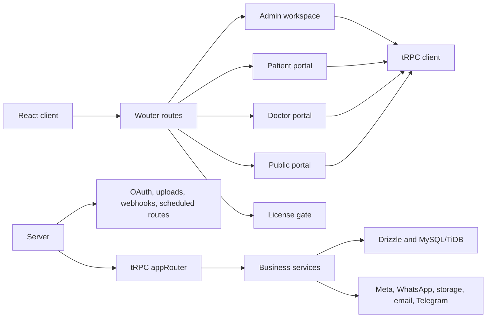

# تعريف النظام الحالي

**الحالة:** `working`  
**المجال:** Overview  
**آخر مراجعة:** 2026-09-18  
**مصادر التحقق:** `client/src/App.tsx`, `client/src/apps/admin/layout/AdminContentRoutes.tsx`, `server/_core/index.ts`, `server/routers/routers.ts`, `server/_core/trpc.ts`

## الهوية والنطاق

BOCAM CRM هو نظام عمليات وCRM طبي متكامل يضم 4 بوابات وظيفية: بوابة تعريفية عامة، ولوحة إدارة وتشغيل داخلية، وبوابة مريض رقمية، وبوابة للكادر الطبي، مع خدمات خلفية لإدارة الحملات والحجوزات والمرضى والمحتوى والاتصالات والتكاملات الخارجية.

يظهر الاسم التاريخي **SGH CRM Portal** في بعض الوثائق والواجهات، لكنه ليس نظامًا مختلفًا. إلى أن يعتمد قرار تجاري آخر، يستخدم التوثيق اسم **BOCAM CRM** كاسم المشروع، ويذكر SGH CRM Portal كاسم تاريخي أو تجاري عند الحاجة.

## المستخدمون والواجهات

| الواجهة | المسار الأساسي | الغرض |
|---|---|---|
| عامة | `/` و`/doctors` و`/offers` و`/camps` و`/page/:slug` | عرض المحتوى العام والخدمات والأطباء والعروض والمخيمات |
| تفعيل | `/activation` | التحقق من صلاحية الترخيص قبل إتاحة معظم التطبيق |
| دخول الإدارة | `/admin-login` | نقطة دخول تسجيل دخول الإدارة |
| إدارة | `/admin/*` | إدارة العمليات والمحتوى والاتصالات والتقارير والنظام (10 وحدات) |
| بوابة المريض | `/patient-portal/*` | دخول المريض وعرض المواعيد والنتائج والملف والعروض والمخيمات |
| بوابة الطبيب | `/doctor-portal/*` | دخول الكادر الطبي، إدارة العيادة وطابور المرضى |
| نظامية | `/offline` و`/404` و`/unauthorized` و`/feature-locked/:feature` | حالات عدم الاتصال، عدم العثور، عدم التفويض، وقفل الميزات |

## تدفق الطلب عالي المستوى

## حدود الطبقات

| الطبقة | المسؤولية الحالية | مصدر التحقق |
|---|---|---|
| `client/src/` | معمارية معيارية ثلاثية الطبقات: النواة المشتركة (`core/`)، والبوابات الأربع (`apps/`)، والوحدات الإدارية العشر (`admin/modules/`) | `client/src/App.tsx`, `docs/architecture/FRONTEND_MODULAR_ARCHITECTURE.md` |
| `server/_core/` | إقلاع الخادم، السياق، tRPC، middleware، الترخيص، الصحة، Vite/static | `server/_core/index.ts` و`tRPC.ts` |
| `server/routers/` | عقود وإجراءات tRPC مجمعة في `appRouter` | `server/routers/routers.ts` |
| `server/api/` | REST routes وOAuth وuploads وwebhooks ومسارات مجدولة | `server/_core/index.ts` |
| `server/services/` | منطق الأعمال والتكاملات المساعدة والإشعارات والتخزين | بنية services الحالية |
| `server/database/` | الاتصال واستعلامات المجال وعمليات قاعدة البيانات | بنية database الحالية |
| `server/integrations/` | Webhooks وSSE وqueues وموصلات Meta والمنصات الخارجية | بنية integrations الحالية |
| `server/tasks/` | مهام cron والمهام التشغيلية | `server/tasks/` |
| `drizzle/` | schema والعلاقات والترحيلات وبيانات seed | `drizzle/schema.ts` و`drizzle/relations.ts` |
| `shared/` | أنواع وثوابت وصلاحيات وإشعارات مشتركة بين العميل والخادم | بنية shared الحالية |
| `e2e/` | اختبارات Playwright لمسارات المستخدم الرئيسية | ملفات `e2e/*.spec.ts` |
| `deploy/` | Docker والنسخ الاحتياطي والمراقبة وNginx | بنية deploy الحالية |

## الخادم والواجهات

يستخدم الخادم Express كنقطة تشغيل، ويجمع بين:

- `api/trpc` لإجراءات `appRouter`.
- OAuth وMeta OAuth وExternal Platform OAuth.
- رفع الملفات ومسارات Webhooks.
- Social Publishing وCMS scheduled routes.
- Notification وTask وCampaign وAppointment scheduled routes.
- WhatsApp SSE.
- Health وSwagger وUpdate وBackup وConfig وLicense Delivery routes.
- Vite في التطوير وstatic serving في الإنتاج.

## مجالات التطبيق

تظهر المجالات في الراوتر الرئيسي والخدمات والصفحات: المصادقة والترخيص، المستخدمون والصلاحيات، الحملات والعملاء المحتملون، المواعيد والتسجيلات، العروض والمخيمات والأطباء، المهام والفرق، المرضى والنتائج، WhatsApp، Meta وSocial Inbox، المحتوى والوسائط، الإشعارات، التقارير والتتبع، والتشغيل.

التفاصيل التنفيذية لكل مجال لا تعتمد هذه الوثيقة وحدها؛ تُراجع في مراحل المجال المحددة في [الخطة التنفيذية](./DOCUMENTATION_EXECUTION_PLAN.md).

## حدود هذا التعريف

هذا تعريف للنظام الحالي ومساراته وحدود طبقاته. لا يمثل مرجعًا تفصيليًا للـ API أو قاعدة البيانات أو الصلاحيات أو سياسات Meta. تلك المراجع يجب أن تُعتمد في مراحلها الخاصة.