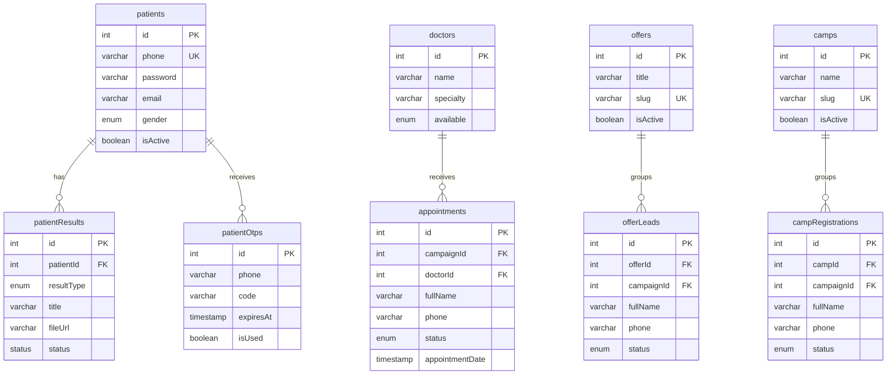
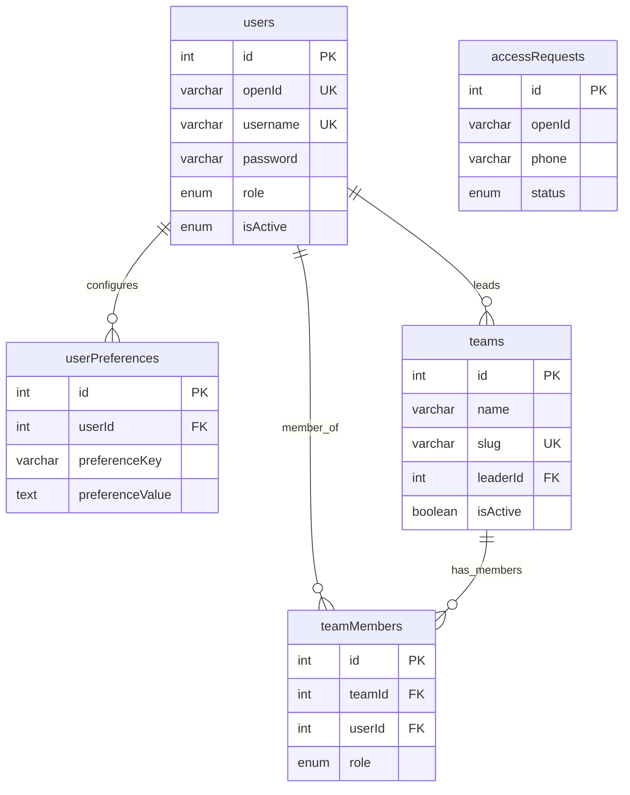
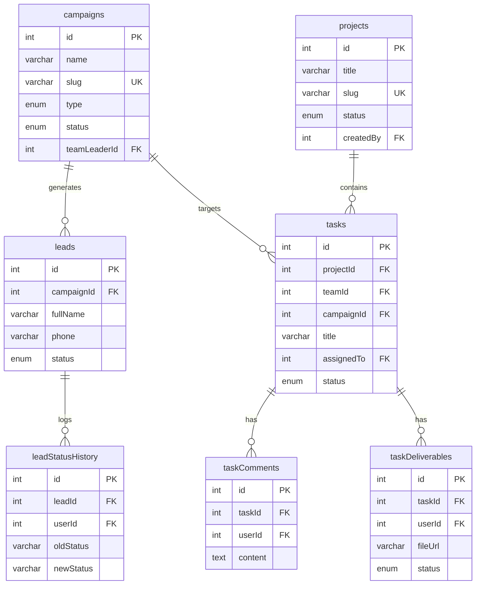

# مخطط علاقات الكيانات لقاعدة البيانات | Database Entity-Relationship Diagram (ERD)

تعتمد منصة **SGH CRM Portal** على قاعدة بيانات علائقية متكاملة (MySQL/TiDB) تحتوي على **40+ جدولاً** لإدارة المرضى، الحجوزات، المحادثات، والمهام. لضمان وضوح العلاقات ومنع تداخل البيانات، تم تقسيم مخطط علاقات قاعدة البيانات (ERD) إلى **أربعة نطاقات فرعية (Sub-domains)** رئيسية متبعةً أفضل الممارسات الهندسية.

---

## 📋 جدول المحتويات
1. [نطاق المرضى والمواعيد والخدمات (Patients & Appointments)](#1-نطاق-المرضى-والمواعيد-والخدمات-patients--appointments)
2. [نطاق المستخدمين والصلاحيات وهيكل العمل (Users, Roles & Teams)](#2-نطاق-المستخدمين-والصلاحيات-وهيكل-العمل-users-roles--teams)
3. [نطاق واتساب والاتصالات الموحدة (WhatsApp & Communications)](#3-نطاق-واتساب-والاتصالات-الموحدة-whatsapp--communications)
4. [نطاق الحملات التسويقية والمهام (Campaigns, Projects & Tasks)](#4-نطاق-الحملات-التسويقية-والمهام-campaigns-projects--tasks)
5. [قواعد التكامل المرجعي والأمان العام (Referential Integrity Guidelines)](#5-قواعد-التكامل-المرجعي-والأمان-العام-referential-integrity-guidelines)

---

## 1️⃣ نطاق المرضى والمواعيد والخدمات (Patients & Appointments)

يغطي هذا النطاق العمليات الأساسية لبوابة المريض العامة وحجوزات مواعيد الأطباء، وحجوزات العروض، وتوصيف المخيمات الطبية والنتائج المعملية والأشعة.

### مخطط العلاقات (Mermaid Diagram)



### جدول العلاقات والتكامل المرجعي

| الجدول التابع (Child Table) | المفتاح الأجنبي (FK) | الجدول الأب (Parent Table) | سلوك الحذف (ON DELETE) | سلوك التحديث (ON UPDATE) | الوصف |
| :--- | :--- | :--- | :--- | :--- | :--- |
| `patientResults` | `patientId` | `patients` | **CASCADE** | **CASCADE** | حذف نتائج التحاليل والأشعة تلقائياً عند حذف حساب المريض. |
| `appointments` | `doctorId` | `doctors` | **RESTRICT** | **CASCADE** | منع حذف الطبيب في حال وجود مواعيد مجدولة مرتبطة به. |
| `offerLeads` | `offerId` | `offers` | **RESTRICT** | **CASCADE** | منع حذف العرض الطبي إذا كان هناك مرضى مسجلين عليه. |
| `campRegistrations` | `campId` | `camps` | **RESTRICT** | **CASCADE** | منع حذف المخيم الطبي في حال وجود مسجلين نشطين. |

---

## 2️⃣ نطاق المستخدمين والصلاحيات وهيكل العمل (Users, Roles & Teams)

يتحكم هذا النطاق في الهيكل الإداري للمستشفى، وتوزيع الصلاحيات (Roles)، والمصادقة الأمنية، وإدارة الفرق التسويقية والميدانية وأعضائها وتفضيلات واجهات الاستخدام.

### مخطط العلاقات (Mermaid Diagram)



### جدول العلاقات والتكامل المرجعي

| الجدول التابع (Child Table) | المفتاح الأجنبي (FK) | الجدول الأب (Parent Table) | سلوك الحذف (ON DELETE) | سلوك التحديث (ON UPDATE) | الوصف |
| :--- | :--- | :--- | :--- | :--- | :--- |
| `userPreferences` | `userId` | `users` | **CASCADE** | **CASCADE** | حذف تفضيلات المستخدم للواجهات فور حذف حسابه. |
| `teams` | `leaderId` | `users` | **SET NULL** | **CASCADE** | في حال حذف حساب القائد، يفرغ حقل القائد ويظل الفريق نشطاً. |
| `teamMembers` | `teamId` | `teams` | **CASCADE** | **CASCADE** | إزالة الأعضاء من رابط العضوية تلقائياً عند إلغاء/حذف الفريق. |
| `teamMembers` | `userId` | `users` | **CASCADE** | **CASCADE** | إزالة عضوية الموظف تلقائياً من جميع الفرق عند حذف حسابه. |

---

## 3️⃣ نطاق واتساب والاتصالات الموحدة (WhatsApp & Communications)

النطاق الأهم والأكثر حماية؛ يربط المحادثات المباشرة الواردة من Meta Cloud API مع المرضى والمسؤولين والعملاء، ويتيح تتبع الردود التلقائية والرسائل الجماعية (Broadcasts).

### مخطط العلاقات (Mermaid Diagram)

```mermaid
erDiagram
    whatsapp_conversations {
        int id PK
        varchar phoneNumber UK
        int leadId FK
        int appointmentId FK
        int offerLeadId FK
        int campRegistrationId FK
        int assignedToUserId FK
        varchar conversationIdMeta
        boolean billable
    }

    whatsapp_messages {
        int id PK
        int conversationId FK
        enum direction
        enum messageType
        enum status
        int sentBy FK
        int replyToMessageId FK
        timestamp sentAt
    }

    users {
        int id PK
        varchar username
    }

    leads {
        int id PK
        varchar phone
    }

    appointments {
        int id PK
        varchar phone
    }

    whatsapp_conversations ||--o{ whatsapp_messages : "contains"
    users ||--o{ whatsapp_conversations : "assigned_to"
    users ||--o{ whatsapp_messages : "sends"
    leads ||--ob whatsapp_conversations : "links_to"
    appointments ||--ob whatsapp_conversations : "links_to"
```

### جدول العلاقات والتكامل المرجعي

| الجدول التابع (Child Table) | المفتاح الأجنبي (FK) | الجدول الأب (Parent Table) | سلوك الحذف (ON DELETE) | سلوك التحديث (ON UPDATE) | الوصف |
| :--- | :--- | :--- | :--- | :--- | :--- |
| `whatsapp_messages` | `conversationId` | `whatsapp_conversations` | **CASCADE** | **CASCADE** | حذف كافة الرسائل التابعة للمحادثة تلقائياً عند حذف المحادثة. |
| `whatsapp_conversations` | `assignedToUserId` | `users` | **SET NULL** | **CASCADE** | إزالة تعيين المحادثة للموظف (Unassign) في حال حذف حساب الموظف. |
| `whatsapp_conversations` | `leadId` | `leads` | **SET NULL** | **CASCADE** | قطع الارتباط مع العميل المحتمل عند حذفه مع الإبقاء على المحادثة. |
| `whatsapp_conversations` | `appointmentId` | `appointments` | **SET NULL** | **CASCADE** | قطع الارتباط مع الموعد في حال حذفه مع الاحتفاظ بسجل المحادثة. |

---

## 4️⃣ نطاق الحملات التسويقية والمهام (Campaigns, Projects & Tasks)

يتتبع الحملات التسويقية الرقمية والميدانية، وتأثيراتها من خلال الـ UTM Parameters، ويرتبط بنظام متكامل لإدارة المشاريع والمهام (Projects & Tasks) ومرفقاتها وتسليماتها لفرق العمل.

### مخطط العلاقات (Mermaid Diagram)



### جدول العلاقات والتكامل المرجعي

| الجدول التابع (Child Table) | المفتاح الأجنبي (FK) | الجدول الأب (Parent Table) | سلوك الحذف (ON DELETE) | سلوك التحديث (ON UPDATE) | الوصف |
| :--- | :--- | :--- | :--- | :--- | :--- |
| `leads` | `campaignId` | `campaigns` | **RESTRICT** | **CASCADE** | يمنع حذف الحملة التسويقية نهائياً في حال وجود عملاء مسجلين عليها. |
| `leadStatusHistory` | `leadId` | `leads` | **CASCADE** | **CASCADE** | حذف سجل الحالات بالكامل عند حذف العميل المحتمل نهائياً. |
| `tasks` | `projectId` | `projects` | **CASCADE** | **CASCADE** | حذف جميع المهام التابعة للمشروع تلقائياً عند حذف المشروع. |
| `tasks` | `campaignId` | `campaigns` | **SET NULL** | **CASCADE** | إبقاء المهام وفصلها عن الحملة التسويقية في حال حذف الحملة. |
| `taskComments` | `taskId` | `tasks` | **CASCADE** | **CASCADE** | إزالة جميع تعليقات المهام عند حذف المهمة البرمجية/التسويقية. |
| `taskDeliverables` | `taskId` | `tasks` | **CASCADE** | **CASCADE** | إزالة ملفات التسليمات عند حذف المهمة المسؤولة. |

---

## 5️⃣ قواعد التكامل المرجعي والأمان العام (Referential Integrity Guidelines)

تطبيقاً لأعلى معايير جودة وهندسة قواعد البيانات الطبية وصيانتها:

1. **حماية السجلات الطبية (Healthcare Data Protection):**
   - يمنع تماماً استخدام خيار `CASCADE ON DELETE` على الأطباء (`doctors`)، المخيمات (`camps`)، أو العروض الطبية (`offers`). يجب أن يكون السلوك الافتراضي دائماً هو `RESTRICT` لضمان عدم حذف أي بيانات تاريخية للمرضى والحجوزات بطريق الخطأ.
   
2. **سجلات الأداء والتدقيق (Auditability):**
   - كافة العمليات التي تجري على حالات المرضى والعملاء يتم تدوينها في جداول التاريخ مثل `leadStatusHistory` وجداول التدقيق العام `auditLogs` لضمان وجود أثر رجعي كامل (Trail Tracking) للتحقيق في أي مشكلات تشغيلية.

3. **الفهارس المركبة والأداء المالي (Indexing & Performance):**
   - تم تزويد جميع جداول الحجوزات والمواعيد بفهارس مركبّة على `(phone, status)` و `(createdAt)` لتسريع عمليات البحث في لوحات التحكم ولضمان الاستجابة اللحظية للتقارير والإحصائيات الكبيرة.
