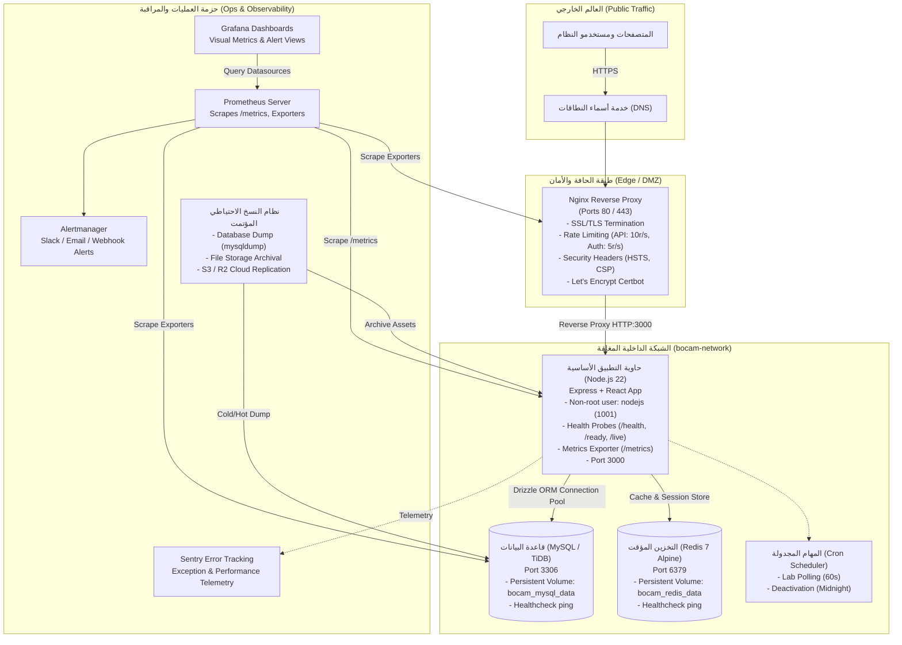
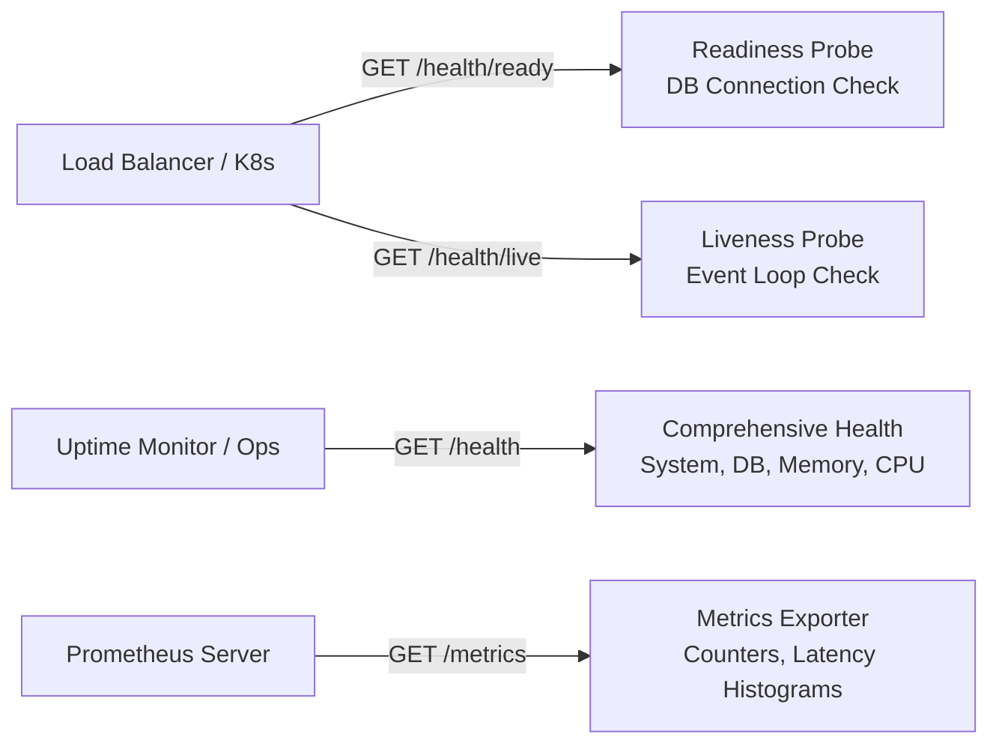
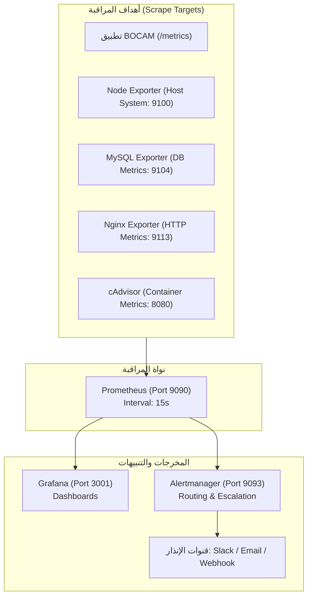
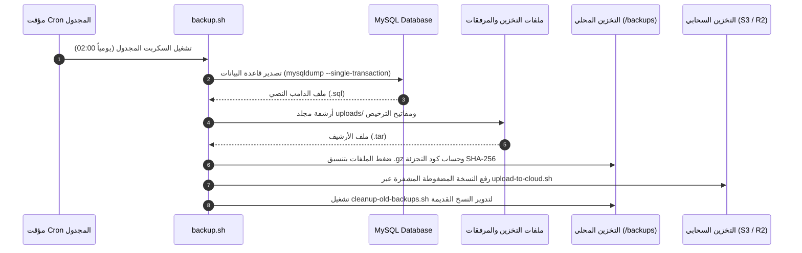

# المرجع التشغيلي المعتمد: العمليات والنشر والمراقبة (Operations, Deployment & Monitoring Runtime Reference)

| الخاصية | القيمة |
| :--- | :--- |
| **الحالة (Status)** | `canonical` |
| **الجمهور المستهدف (Audience)** | `operations` / `devops` / `engineering` |
| **المجال (Domain)** | `operations` |
| **المالك (Owner)** | `devops` |
| **تاريخ آخر مراجعة (Last Reviewed)** | 2026-09-13 |

---

## 1. نظرة عامة والمعمارية التشغيلية (Architecture Overview & Topology)

يمثل هذا المستند المرجع التقني والتشغيلي المعتمد لمنصة **BOCAM CRM** لإدارة عمليات النشر، وبناء الحاويات، وإدارة خوادم الويب، ومسارات التحقق من الصحة، وأنظمة النسخ الاحتياطي، والمراقبة الحية والمهام المجدولة.

تعتمد البنية التحتية للمنصة على معمارية معزولة تعتمد الحاويات وتفصل حركة المرور الخارجية العامة عن الخدمات الداخلية وقواعد البيانات عبر شبكة Docker داخلية خاصة (`bocam-network`).



---

## 2. بناء وتشغيل الحاويات (Containerization & Docker Multi-Stage Build)

تعتمد المنصة بناء صور حاويات متعددة المراحل (Multi-stage build) مبنية على توزيعة `node:22-alpine` لتقليص حجم الصورة النهائية وتجريدها من أدوات التطوير وضمان أعلى معايير الأمان وتقليص سطح الهجوم.

### 2.1 مراحل البناء (Dockerfile Stages)

المصدر البرمجي المعتمد: [Dockerfile](../../Dockerfile) و [deploy/Dockerfile](../../deploy/Dockerfile).

```dockerfile
# 1. مرحلة الأساس (Base Stage)
FROM node:22-alpine AS base
RUN apk add --no-cache libc6-compat python3 make g++
WORKDIR /app
RUN corepack enable && corepack prepare pnpm@latest --activate

# 2. مرحلة تثبيت الاعتماديات (Dependencies Stage)
FROM base AS dependencies
COPY package.json pnpm-lock.yaml ./
RUN pnpm install --frozen-lockfile

# 3. مرحلة بناء الكود (Builder Stage)
FROM dependencies AS builder
COPY . .
ENV NODE_ENV=production
RUN pnpm build

# 4. مرحلة التشغيل الإنتاجي (Production Runner Stage)
FROM node:22-alpine AS runner
WORKDIR /app
ENV NODE_ENV=production
ENV PORT=3000

# إنشاء مستخدم ونظام أمان غير جذري (Least Privilege)
RUN addgroup --system --gid 1001 nodejs && \
    adduser --system --uid 1001 nodejs

# نسخ مخرجات البناء والاعتماديات الإنتاجية
COPY --from=builder --chown=nodejs:nodejs /app/dist ./dist
COPY --from=builder --chown=nodejs:nodejs /app/node_modules ./node_modules
COPY --from=builder --chown=nodejs:nodejs /app/package.json ./package.json

USER nodejs
EXPOSE 3000

# فحص صحة الحاوية التلقائي (Healthcheck)
HEALTHCHECK --interval=30s --timeout=10s --start-period=40s --retries=3 \
  CMD wget --no-verbose --tries=1 --spider http://localhost:3000/health || exit 1

CMD ["node", "dist/index.js"]
```

### 2.2 ميزات الأمان في الحاوية
1. **المستخدم غير الجذري (`nodejs:1001`):** يعمل التطبيق تحت مستخدم نظام مخصص لمنع تصعيد الصلاحيات (Privilege Escalation).
2. **عزل اعتمادات التطوير:** لا تحتوي الصورة الإنتاجية على أدوات البناء مثل `make` أو `g++` أو اعتماديات `devDependencies`.
3. **فحص الصحة المدمج (`HEALTHCHECK`):** يضمن أن بيئات التشغيل مثل Docker وKubernetes تستطيع رصد تجمد الحاوية وإعادة تشغيلها آلياً.

---

## 3. أوركسترا الخدمات عبر Docker Compose

تدار الخدمات التشغيلية في بيئات الإنتاج والتجارب الميدانية عبر ملفات التكوين [docker-compose.yml](../../docker-compose.yml) و [deploy/docker-compose.yml](../../deploy/docker-compose.yml).

### 3.1 هيكل الخدمات المشغلة

| الخدمة (Service) | الصورة (Image) | المنافذ الداخلية والخارجية | الغرض التشغيلي | آليات التحقق من الصحة (Healthcheck) |
| :--- | :--- | :--- | :--- | :--- |
| **`app`** | تم بناؤها من `Dockerfile` | `3000:3000` | تطبيق Express الخلفي وواجهة React المجمعة | `wget http://localhost:3000/health` |
| **`mysql`** | `mysql:8.0` أو TiDB | `3306:3306` (داخلي) | قاعدة البيانات العلائقية ومخزن السجلات | `mysqladmin ping -h localhost` |
| **`redis`** | `redis:7-alpine` | `6379:6379` (داخلي) | التخزين المؤقت وحفظ الجلسات وإلغاء القفل | `redis-cli ping` |

### 3.2 وسائط التخزين المستديمة (Persistent Volumes)
- **`bocam_mysql_data`:** تخزين ملفات جداول وفهارس قاعدة البيانات بشكل دائم خارج دورة حياة الحاويات.
- **`bocam_redis_data`:** تخزين بيانات الذاكرة الدائمة لـ Redis (AOF/RDB).
- **`./uploads`:** مجلد محلي على الخادم مربوط بالحاوية (`/app/uploads`) لتخزين مرفقات المرضى والتقارير الطبية.
- **`./license.json` و `./license-keys`:** ملفات الترخيص ومفاتيح RSA المشفرة للتحقق من هوية المنشأة.

### 3.3 عزل الشبكة (Network Isolation)
ترتبط جميع الحاويات عبر شبكة بريدج خاصة:
```yaml
networks:
  bocam-network:
    driver: bridge
```
- المنفذ `3000` يوجه فقط إلى البروكسي العكسي Nginx، ولا يتم كشف منافذ `3306` (MySQL) أو `6379` (Redis) للإنترنت العام نهائياً.

---

## 4. خادم الويب والبروكسي العكسي وتأمين SSL (Nginx & SSL Hardening)

المصدر البرمجي المعتمد: [deploy/nginx/nginx.conf](../../deploy/nginx/nginx.conf).

### 4.1 إدارة الاتصالات وتحديد المعدل (Rate Limiting)
يقوم خادم Nginx بحماية المنصة من هجمات الحرمان من الخدمة (DoS) ومحاولات التخمين عبر منطقتين معزولتين لتحديد المعدل:

```nginx
# 1. تحديد المعدل للواجهات البرمجية العامة (10 طلبات/ثانية مع سماحية اندفاع 20)
limit_req_zone $binary_remote_addr zone=api_limit:10m rate=10r/s;

# 2. تحديد المعدل لمسارات المصادقة وتسجيل الدخول (5 طلبات/ثانية مع سماحية اندفاع 5)
limit_req_zone $binary_remote_addr zone=auth_limit:10m rate=5r/s;
```

### 4.2 بروتوكولات وتشفير SSL/TLS
- **البروتوكولات المدعومة:** `TLSv1.2 TLSv1.3` حصراً، مع إلغاء الإصدارات غير الآمنة (SSLv3, TLS 1.0, TLS 1.1).
- **الشفرات القوية (Cipher Suite):**
  `ECDHE-ECDSA-AES128-GCM-SHA256:ECDHE-RSA-AES128-GCM-SHA256:ECDHE-ECDSA-AES256-GCM-SHA384:ECDHE-RSA-AES256-GCM-SHA384`
- **التدبيس والتسريع (OCSP Stapling):**
  مفعل افتراضياً مع `ssl_stapling on;` و `ssl_stapling_verify on;` لتسريع المصافحة الرقمية.

### 4.3 رؤوس الأمان الإلزامية (HTTP Security Headers)
```nginx
add_header X-Frame-Options "SAMEORIGIN" always;
add_header X-XSS-Protection "1; mode=block" always;
add_header X-Content-Type-Options "nosniff" always;
add_header Referrer-Policy "strict-origin-when-cross-origin" always;
add_header Strict-Transport-Security "max-age=31536000; includeSubDomains; preload" always;
add_header Content-Security-Policy "default-src 'self'; script-src 'self' 'unsafe-inline' 'unsafe-eval'; style-src 'self' 'unsafe-inline'; img-src 'self' data: https:; font-src 'self' data:;" always;
```

### 4.4 إدارة وتجديد شهادات Let's Encrypt تلقائياً
- مسار التحقق الرقمي ACME:
  ```nginx
  location /.well-known/acme-challenge/ {
      root /var/www/certbot;
  }
  ```
- **سكربتات الإعداد والتجديد المعتمدة:**
  - `deploy/nginx/setup-ssl.sh`: تثبيت الشهادة لأول مرة وربط النطاق.
  - `deploy/nginx/setup-auto-renewal.sh`: إعداد مؤقت مجدول في النظام.
  - `deploy/nginx/certbot-renewal.timer` و `certbot-renewal.service`: مؤقت Systemd لفحص وتجديد الشهادات مرتين يومياً.
  - `deploy/nginx/verify-ssl.sh`: سكربت فحص سلامة التشفير ومطابقة تاريخ انتهاء الشهادة.

---

## 5. مسارات التحقق التشغيلي والقياسات الحية (Health Probes & Metrics)

المصدر البرمجي المعتمد: [server/_core/health.ts](../../server/_core/health.ts).

توفر المنصة 4 مسارات HTTP قياسية تستخدمها أدوات الأوركسترا (Docker/Kubernetes/Load Balancer) وأنظمة المراقبة:



### 5.1 تفاصيل المسارات التشغيلية

| المسار (Endpoint) | الطريقة | الغرض التشغيلي | رمز الاستجابة الناجحة | رمز الاستجابة الفاشلة | الحقول المعادة |
| :--- | :---: | :--- | :---: | :---: | :--- |
| **`/health`** | `GET` | فحص صحة عام ومفصل لموارد النظام وقاعدة البيانات | `200 OK` (أو degraded) | `503 Service Unavailable` | `status`, `timestamp`, `uptime`, `database`, `memory`, `cpu` |
| **`/health/ready`** | `GET` | مسبار الجاهزية (Readiness Probe) لاستقبال حركة المرور | `200 OK` | `503 Service Unavailable` | `ready: true/false`, `database: "connected"` |
| **`/health/live`** | `GET` | مسبار الحيوية (Liveness Probe) لفحص حلقة الأحداث | `200 OK` | - | `alive: true`, `timestamp` |
| **`/metrics`** | `GET` | تصدير قياسات المراقبة بتنسيق Prometheus المعتمد | `200 OK` | `500 Internal Error` | مقاييس الذاكرة وعدد الطلبات وزمن الاستجابة |

### 5.2 نموذج استجابة `/health` الشاملة
```json
{
  "status": "healthy",
  "timestamp": "2026-09-13T04:10:00.000Z",
  "uptime": 86400,
  "environment": "production",
  "database": {
    "status": "connected",
    "responseTimeMs": 3.4
  },
  "memory": {
    "rss": "120MB",
    "heapTotal": "85MB",
    "heapUsed": "62MB",
    "heapUsedPercentage": "72.9%"
  },
  "cpu": {
    "user": 1240000,
    "system": 450000
  }
}
```

---

## 6. مجموعة المراقبة والإنذار (Monitoring & Observability Stack)

المصدر البرمجي المعتمد: [deploy/monitoring/](../../deploy/monitoring).

### 6.1 مصفوفة مجمعات المقاييس (Metric Collectors & Exporters)



### 6.2 قواعد الإنذار التشغيلية المعتمدة (Alerting Rules)
المصدر: `deploy/monitoring/alertmanager.yml` و `prometheus.yml`:
1. **انقطاع قاعدة البيانات (`DatabaseDown`):** يتم إطلاق إنذار فوري (خلال 30 ثانية) في حال فشل اتصال التطبيق بقاعدة البيانات.
2. **استهلاك الذاكرة المرتفع (`HighMemoryUsage`):** إنذار عند تجاوز استهلاك الذاكرة 90% لأكثر من 5 دقائق.
3. **ارتفاع استهلاك المعالج (`HighCPUUsage`):** إنذار عند استمرار استهلاك المعالج فوق 85% لمدة 10 دقائق متواصلة.
4. **امتلاء مساحة القرص (`DiskSpaceRunningOut`):** إنذار عند انخفاض المساحة المتاحة للقرص عن 15%.
5. **توقف حاوية التطبيق (`ContainerDown`):** إنذار عند فشل `up{job="bocam-app"} == 0` لأكثر من دقيقة.

### 6.3 تتبع الأخطاء والاستثناءات عبر Sentry
المصدر: `deploy/monitoring/sentry-config.js`:
- جمع الأخطاء البرمجية اللحظية (Unhandled Exceptions و Unhandled Promise Rejections).
- قياس أداء المعاملات والمسارات الحساسة (Performance Tracing).
- **أمن وسرية البيانات:** تفعيل مرشحات الحجب (PII Scrubbing) لإخفاء بيانات المرضى، كلمات المرور، والبيانات البنكية قبل إرسالها إلى Sentry.

---

## 7. نظام النسخ الاحتياطي والتعافي من الكوارث (Backup & Disaster Recovery Runbook)

المصدر البرمجي المعتمد: [deploy/backup/](../../deploy/backup).

### 7.1 هيكل وتدفق النسخ الاحتياطي



### 7.2 سياسة استبقاء النسخ الاحتياطية (Retention Policy)
تدار السياسة عبر سكربت `cleanup-old-backups.sh`:
- **النسخ اليومية (Daily):** الاحتفاظ بآخر 7 نسخ يومية كاملة.
- **النسخ الأسبوعية (Weekly):** الاحتفاظ بآخر 4 نسخ أسبوعية.
- **النسخ الشهرية (Monthly):** الاحتفاظ بآخر 12 نسخة شهرية للأرشفة القانونية والطبية.

### 7.3 إجراءات الاستعادة والتعافي من الكوارث (Disaster Recovery Runbook)

في حال حدوث عطل جسيم أو انهيار في الخادم أو تلف في البيانات، يتم اتباع الخطوات التالية بدقة:

#### الخطوة 1: إيقاف التطبيق أو تحويله إلى وضع الصيانة
```bash
# إيقاف استقبال طلبات جديدة لمنع الكتابة غير المتناسقة
docker compose stop app
```

#### الخطوة 2: فحص سلامة ملف النسخة الاحتياطية
```bash
cd /opt/backups
# التحقق من سلامة الأرشيف عبر فحص كود التجزئة SHA-256
sha256sum -c bocam_db_20260913_020000.sql.gz.sha256
```

#### الخطوة 3: استعادة قاعدة البيانات
```bash
# فك الضغط وتمرير البيانات مباشرة إلى خادم MySQL
gunzip < bocam_db_20260913_020000.sql.gz | mysql -u root -p bocam_crm
```

#### الخطوة 4: استعادة ملفات المرفقات والتراخيص
```bash
# استعادة ملفات المرفقات الطبية وتراخيص النظام
tar -xzf bocam_files_20260913_020000.tar.gz -C /opt/bocam/
```

#### الخطوة 5: تشغيل هجرات قاعدة البيانات والتحقق من التناسق
```bash
# التأكد من تطابق مخطط قاعدة البيانات مع إصدار الكود
pnpm db:migrate
```

#### الخطوة 6: تشغيل الحاويات وفحص الجاهزية
```bash
docker compose up -d app
# التحقق من أن مسبار الجاهزية يعيد 200 OK
curl -I http://localhost:3000/health/ready
```

---

## 8. المهام المجدولة بالخلفية (Background Tasks & Cron Scheduler)

المصدر البرمجي المعتمد: [server/tasks/cron/scheduler.ts](../../server/tasks/cron/scheduler.ts).

يحتوي النظام على مجدول مهام داخلي يعمل ضمن دورة حياة الخادم الخلفي لتنفيذ المهام الدورية الحرجة دون الاعتماد على مشغلات خارجية.

### 8.1 المهام المسجلة في المجدول

| المهمة (Job Name) | التكرار (Interval) | التعبير الزمني (Cron Expression) | الوظيفة التشغيلية | آلية منع التداخل والتزامن |
| :--- | :--- | :--- | :--- | :--- |
| **`pollLabResults`** | كل دقيقة (60 ثانية) | `*/1 * * * *` | فحص ومزامنة نتائج التحاليل الطبية الواردة من المختبرات الخارجية وتحديث سجلات المرضى | قفل داخلي بالذاكرة (`isPollingLabs`) يمنع تشغيل دورة جديدة إذا كانت الدورة السابقة قيد التنفيذ |
| **`patientDeactivationJob`** | يومياً عند منتصف الليل | `0 0 * * *` | إلغاء تفعيل السجلات غير النشطة وفق سياسات العيادة، ومراجعة حالات التنبيهات المنتهية | قفل دوري بالذاكرة وحصر التنفيذ في عملية واحدة |

### 8.2 أمان وإيقاف المجدول الانسيابي (Graceful Shutdown)
- يتم تشغيل المجدول آلياً عند بدء تشغيل الخادم عبر استدعاء `initScheduler()`.
- عند استقبال إشارات إنهاء النظام (`SIGTERM` أو `SIGINT`)، يتم استدعاء `stopScheduler()` لإيقاف الجدولة فوراً والسماح للمهام الجارية حالياً بإنهاء معاملاتها بأمان دون فقدان للبيانات.

---

## 9. دليل إجراءات النشر وإدارة الإصدارات (Deployment Runbook)

### 9.1 قائمة التحقق قبل النشر (Pre-Deployment Checklist)
1. **فحص متغيرات البيئة:** تشغيل `node scripts/check-env.mjs` للتأكد من توافر كافة المتغيرات الإلزامية في ملف `.env`.
2. **فحص الأنواع البرمجية والتجميع:** التحقق من نجاح `pnpm check` و `pnpm build`.
3. **أخذ نسخة احتياطية فورية:** تشغيل `./deploy/backup/backup.sh` قبل تنفيذ أي تحديث.
4. **فحص هجرات قاعدة البيانات:** مراجعة ملفات الترقية في مجلد `drizzle/` والتأكد من عدم وجود تغييرات مهددة للبيانات القديمة.

### 9.2 خطوات النشر القياسي (Standard Deployment Workflow)
```bash
# 1. سحب أحدث نسخة من المستودع
git pull origin main

# 2. تثبيت الحزم وتحديث الاعتماديات
pnpm install --frozen-lockfile

# 3. بناء الحاويات وتحديثها مع تفادي التوقف التام
docker compose -f deploy/docker-compose.yml up -d --build app

# 4. تنفيذ هجرات قاعدة البيانات داخل الحاوية
docker compose -f deploy/docker-compose.yml exec app pnpm db:migrate

# 5. التحقق من مسار الجاهزية
curl -f http://localhost:3000/health/ready || exit 1
```

### 9.3 إجراءات التراجع الفوري (Rollback Runbook)
في حال فشل الاختبارات التشغيلية بعد النشر أو حدوث تراجع في الأداء:
1. **استرجاع إصدار الحاوية السابقة:**
   ```bash
   docker compose -f deploy/docker-compose.yml rollback app
   # أو الرجوع إلى الوسم السابق للالتزام في Git
   git checkout <PREVIOUS_COMMIT_TAG>
   docker compose -f deploy/docker-compose.yml up -d --build app
   ```
2. **استرجاع حالة قاعدة البيانات:** إذا تضمنت الهجرة تعديلات غير متوافقة مع الإصدار القديم، يتم تطبيق إجراءات الاستعادة الموضحة في القسم 7.3 من آخر نسخة احتياطية تم أخذها قبل النشر.

### 9.4 حزمة التوزيع المستقلة (Client Release Bundle)
المصدر: `release/` و `release/DEPLOYMENT.txt`:
- مخصصة للعملاء الذين يعتمدون التثبيت المحلي على خوادمهم الخاصة (On-Premises).
- تتطلب بيئة تشغيل Node.js >= 22.
- يتم تزويد العميل بحزمة كود مهيأة مسبقاً لا تحتوي على بيئات التطوير.
- الربط مع ملف ترخيص `license.json` مصادق عليه برقم النطاق `LICENSE_DOMAIN`.

---

## 10. الحوكمة والأمن التشغيلي (Operational Security & Hardening)

1. **إدارة الأسرار:** يمنع منعاً باتاً تضمين مفاتيح التشفير، كلمات مرور قواعد البيانات، أو أسرار JWT داخل ملفات التوثيق أو مستودع الكود. يتم توفير ملفات أمثلة آمنة فقط مثل `.env.example` و `deploy/.docker.env.example`.
2. **مبدأ الصلاحيات الدنيا (Least Privilege):** تشغيل جميع الخدمات تحت مستخدمين محدودي الصلاحيات (حاوية التطبيق: `1001`, قاعدة البيانات: مستخدم بصلاحيات محدودة للبيانات التشغيلية فقط).
3. **تدوير السجلات (Log Rotation):** تهيئة Docker Daemon لتدوير سجلات الحاويات تلقائياً (حجم أقصى 20 ميجابايت لكل ملف بحد أقصى 5 ملفات) لتفادي استهلاك كامل مساحة القرص:
   ```json
   {
     "log-driver": "json-file",
     "log-opts": {
       "max-size": "20m",
       "max-file": "5"
     }
   }
   ```
