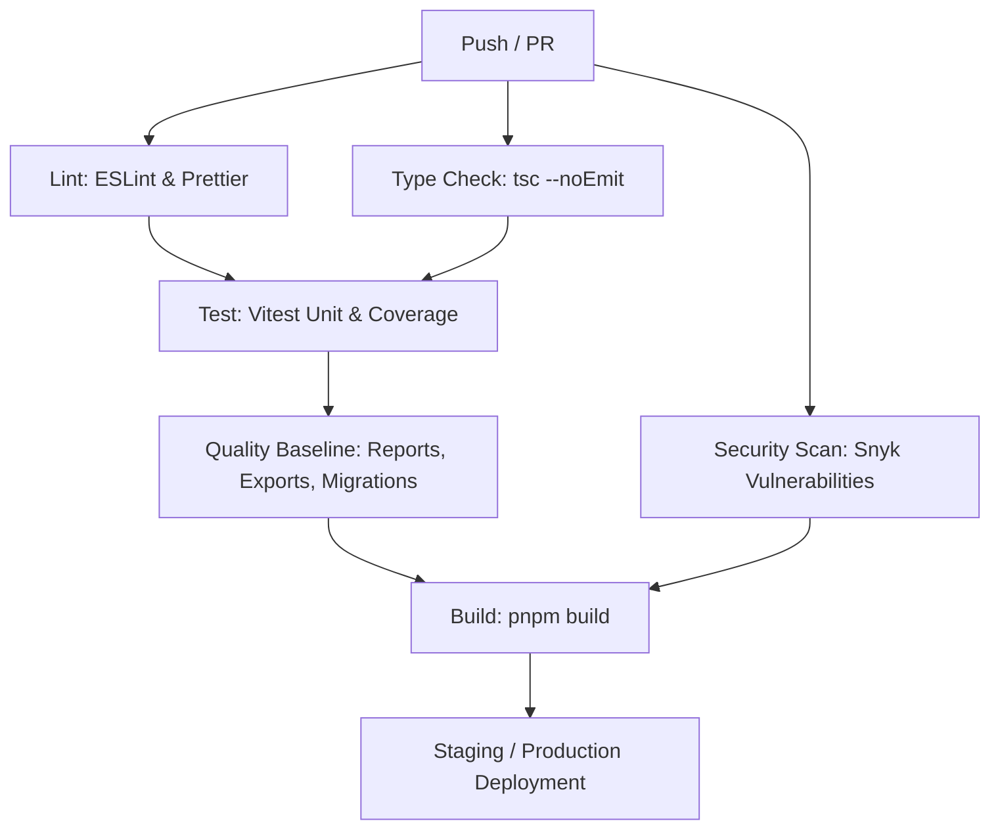

# المرجع التشغيلي للاختبارات وهندسة الجودة وخطوط الأساس

## بيانات الحوكمة والمطابقة

| الحقل | القيمة المعتمدة |
|---|---|
| **الحالة** | `canonical` |
| **الجمهور** | مطور، مهندس جودة واختبارات، مهندس DevOps، مراجع معماري |
| **المجال** | `testing-quality` (هندسة الاختبارات، الجودة، وبوابات CI) |
| **المصدر** | `vitest.config.ts`, `playwright.config.ts`, `vitest.setup.ts`, `client/**/__tests__`, `server/**/__tests__`, `e2e/`, `.github/workflows/ci.yml`, `scripts/coverage-baseline.mjs`, `scripts/generate-quality-report.mjs` |
| **آخر مراجعة** | 2026-09-13 |
| **المالك** | QA & Core Infrastructure Engineering Team |
| **البديل** | لا يوجد (المرجع الأساسي المعتمد لهرم الاختبارات وبوابات الجودة والتكامل المستمر) |

---

## 1. هرم الاختبارات وهندسة الجودة (Testing Pyramid Architecture)

يعتمد مشروع **BOCAM CRM** على استراتيجية هرم اختبارات ثلاثية الطبقات مصممة لتحقيق التوازن بين سرعة التنفيذ ودقة التحقق وعزل البيئات:

```
                                  ┌───────────────────────────┐
                                  │         E2E Tests         │
                                  │   (Playwright / 6 Suites) │
                                  │     User Flows & A11y     │
                                  └─────────────┬─────────────┘
                                                │
                                  ┌─────────────▼─────────────┐
                                  │     Integration Tests     │
                                  │   (Vitest + RTL + tRPC)   │
                                  │  Routers, RBAC, Workspaces│
                                  └─────────────┬─────────────┘
                                                │
                                  ┌─────────────▼─────────────┐
                                  │        Unit Tests         │
                                  │  (Vitest + TypeScript)    │
                                  │  Utils, Hooks, DB, Helpers│
                                  └───────────────────────────┘
```

### مستويات الهرم:
1. **اختبارات الوحدة (Unit Tests):** تغطي الدوال المساعدة، والخطافات (Hooks)، وخدمات التحويل وتنسيق البيانات، والعمليات الحسابية بدون اعتماد على خوادم خارجية.
2. **اختبارات التكامل (Integration Tests):** تختبر راوترات tRPC، وإجراءات حماية الصلاحيات (`permissionProcedure`)، وتكامل مكونات واجهة المستخدم React مع طبقة الحالة.
3. **اختبارات النهاية إلى النهاية (E2E Tests):** تختبر رحلات المستخدم الكاملة عبر المتصفحات الحقيقية (Chromium, Firefox, WebKit)، بما في ذلك تدفقات تسجيل الدخول، والتنقل في لوحة التحكم، وبوابة المرضى، ومسح إمكانية الوصول التلقائي بمحرك `@axe-core/playwright`.

---

## 2. بيئة تشغيل Vitest والمحاكاة (`vitest.config.ts` & `vitest.setup.ts`)

### 2.1 تكوين إطار Vitest (`vitest.config.ts`)
- **بيئة المحاكاة:** `environment: "jsdom"` لدعم محاكاة شجرة DOM الخاصة بالمتصفح للمكونات والخطافات.
- **المسارات المضمنة:** تشمل اختبارات الخادم والواجهة عبر النمط:
  - `server/**/*.test.ts`, `server/**/*.spec.ts`
  - `client/src/**/*.test.ts`, `client/src/**/*.test.tsx`
- **الاستثناءات الصريحة وأسبابها:**
  - `client/src/hooks/__tests__/useExportUtils.test.ts`: مستثنى لاحتياجه لمحاكاة تدفقات مكتبات Excel الثقيلة في بيئة تشغيل مستقلة.
  - `client/src/components/animations/__tests__/**` و`client/src/components/__tests__/**`: بعض اختبارات المكونات المعتمدة على محركات Canvas/WebGL معزولة لتفادي استهلاك موارد الذاكرة في الاختبارات السريعة.
  - `client/src/__tests__/ChatWindow.test.tsx`: معزول مؤقتًا لاعتماده على خادم WebSocket نشط.
  - `client/src/__tests__/accessibility.test.tsx`: معزول في اختبارات الوحدة لأن الفحص الحقيقي لمعايير WCAG AA ومحرك axe-core ينفذ في بيئة متصفح كاملة ضمن `e2e/accessibility.spec.ts`.
- **حدود التغطية (Coverage Thresholds):** مضبوطة عند 50% للأسطر والوظائف والشعب والعبارات للمسارات الخاضعة للقياس.

### 2.2 ملف الإعداد والمحاكاة العامة (`vitest.setup.ts`)
يتم تحميله تلقائيًا قبل بدء جميع الاختبارات، ويوفر:
- **المتغيرات البيئية الآمنة:**
  - `LICENSE_HARDWARE_ID = '42004E494300'`: معرف عتاد تجريبي يحاكي الترخيص الرقمي.
  - `DATABASE_URL = 'mysql://root:@127.0.0.1:3306/bocam'`: رابط قاعدة بيانات وهمي معزول.
  - `OAUTH_SERVER_URL` و`META_APP_ID`: روابط آمنة للاختبارات.
- **المحاكاة الشاملة لواجهات المتصفح:**
  - `localStorage` و`sessionStorage`: تنفيذ كامل ومستقل في الذاكرة مع تنظيف تلقائي بعد كل اختبار (`afterEach`).
  - `window.matchMedia`: محاكاة كاملة لدعم فحص تفضيلات السمة الفاتحة والداكنة وتغير أبعاد الشاشة.
  - `EventSource`: محاكاة دقيقة لبروتوكول البث اللحظي (SSE) للتحقق من رسائل WhatsApp وتحديثات الإشعارات الحية دون خادم حقيقي.
  - تفعيل أدوات المطابقة لمكتبة `@testing-library/jest-dom`.

---

## 3. إعدادات Playwright ومسارات E2E (`playwright.config.ts`)

### 3.1 تكوين Playwright
- **دليل الاختبارات:** `./e2e`.
- **الخادم المدمج:** تشغيل خادم الاختبارات آليًا عبر `pnpm dev` على المنفذ `http://localhost:3000` مع مهلة 120 ثانية.
- **التشغيل المتوازي:** مفعّل كليًا (`fullyParallel: true`) مع تقليل عدد المسارات في بيئات CI لمنع التنافس على الموارد.
- **المتصفحات المستهدفة:**
  - `chromium`: محاكاة بيئة سطح المكتب Chrome وEdge.
  - `firefox`: محاكاة محرك Gecko.
  - `webkit`: محاكاة Safari ومتصفحات بيئة Apple.

### 3.2 مسارات E2E الستة الأساسية

| المسار | ملف الاختبار | الغرض وسيناريو التحقق |
|---|---|---|
| **إمكانية الوصول** | `e2e/accessibility.spec.ts` | مسح آلي كامل للصفحة الرئيسية ولوحة التحكم عبر `@axe-core/playwright` والتحقق من عدم وجود أي انتهاكات لمعايير WCAG 2.1 AA |
| **لوحة الإدارة** | `e2e/admin-dashboard.spec.ts` | التحقق من الإطار الإداري `DashboardShell`, الشريط الجانبي, فتح التبويبات المتعددة والتنقل السلس |
| **المصادقة والجلسة** | `e2e/auth.spec.ts` | تدفق تسجيل الدخول المحلي, حماية مسارات الإدارة, استمرار الجلسة, وتسجيل الخروج |
| **الصفحات العامة** | `e2e/basic.spec.ts` | تحميل الصفحة الرئيسية, التحقق من وجود الشعار والقائمة والتذييل والروابط الأساسية |
| **بوابة المريض** | `e2e/patient-portal.spec.ts` | تسجيل دخول المريض عبر OTP, استعراض المواعيد المحجوزة, وقراءة التقارير الطبية |
| **تكامل WhatsApp** | `e2e/whatsapp.spec.ts` | استعراض لوحة تحكم WhatsApp, فحص القوالب, وإدارة المحادثات الواردة والصادرة |

---

## 4. الحصر والتوزيع الفعلي لملفات الاختبارات

يحتوي المستودع على **196 ملف اختبار** موزعة كالتالي:

| الطبقة / النطاق | عدد الملفات | مجالات التغطية الرئيسية |
|---|---:|---|
| **اختبارات الخادم (`server/`)** | 97 | راوترات tRPC، خدمات الأعمال، حماية الصلاحيات RBAC، Webhooks، خدمات Meta وWhatsApp، التشفير والترخيص |
| **اختبارات الواجهة (`client/`)** | 93 | المكونات المشتركة، التخطيط والتبويبات، الوضع الداكن، الفلاتر والجداول، النماذج، والخطافات |
| **اختبارات المسار الكامل (`e2e/`)** | 6 | إمكانية الوصول، لوحة التحكم، المصادقة، الصفحة العامة، بوابة المريض، WhatsApp |
| **الإجمالي العام** | **196** | **تغطية شاملة لكافة طبقات النظام** |

---

## 5. مصفوفة الربط المباشر (Feature → Test → Documentation)

| المجال الوظيفي | ملفات الاختبار الأساسية | الوثيقة المرجعية المعتمدة |
|---|---|---|
| **المصادقة وRBAC** | `server/modules/07-users-rbac/__tests__/*.test.ts`, `server/routers/rbac.*.workflow.test.ts`, `client/src/core/hooks/__tests__/useRolePermissions.test.ts`, `e2e/auth.spec.ts` | [docs/AUTHENTICATION_RBAC.md](../AUTHENTICATION_RBAC.md) |
| **الترخيص وحماية التشغيل** | `server/_core/__tests__/license.test.ts`, `server/subsystems/licensing/__tests__/validation.test.ts`, `client/src/core/hooks/__tests__/useLicense.test.ts` | [docs/licensing/LICENSE_RUNTIME_REFERENCE.md](../licensing/LICENSE_RUNTIME_REFERENCE.md) |
| **المواعيد والحجوزات** | `server/modules/01-booking-scheduling/__tests__/appointments.test.ts`, `client/src/apps/admin/modules/01-booking-scheduling/__tests__/AppointmentsTab.test.ts` | [docs/domains/APPOINTMENTS_RUNTIME_REFERENCE.md](./APPOINTMENTS_RUNTIME_REFERENCE.md) |
| **المرضى وبوابة المريض** | `server/modules/02-crm-patients/__tests__/patients.db.test.ts`, `client/src/pages/patient-portal/*.test.tsx`, `e2e/patient-portal.spec.ts` | [docs/domains/PATIENT_PORTAL_RUNTIME_REFERENCE.md](./PATIENT_PORTAL_RUNTIME_REFERENCE.md) |
| **الحملات والعملاء المحتملون** | `server/modules/04-marketing-publishing/__tests__/campaigns.test.ts`, `server/modules/01-booking-scheduling/__tests__/leads.test.ts` | [docs/domains/CAMPAIGNS_LEADS_RUNTIME_REFERENCE.md](./CAMPAIGNS_LEADS_RUNTIME_REFERENCE.md) |
| **العروض والمخيمات والأطباء** | `server/modules/01-booking-scheduling/__tests__/camps.test.ts`, `offers.test.ts`, `doctors.test.ts` | [docs/domains/OFFERS_CAMPS_DOCTORS_RUNTIME_REFERENCE.md](./OFFERS_CAMPS_DOCTORS_RUNTIME_REFERENCE.md) |
| **WhatsApp وWebhooks** | `server/modules/03-omni-inbox/__tests__/whatsapp.test.ts`, `server/integrations/webhooks/__tests__/whatsappWebhook.test.ts`, `e2e/whatsapp.spec.ts` | [docs/api/WHATSAPP_INTEGRATION.md](../api/WHATSAPP_INTEGRATION.md) |
| **Meta وSocial Inbox** | `server/api/webhooks/webhookRoutes.test.ts`, `server/api/webhooks/metaSocialWebhookRoute.test.ts`, `server/modules/03-omni-inbox/__tests__/socialInbox.test.ts` | [docs/api/META_INTEGRATION_GUIDE.md](../api/META_INTEGRATION_GUIDE.md) |
| **إدارة المحتوى والوسائط** | `server/modules/05-cms-portal/__tests__/*.test.ts`, `client/src/apps/admin/modules/05-cms-portal/__tests__/*.test.ts` | [docs/CONTENT_MANAGEMENT_README.md](../CONTENT_MANAGEMENT_README.md) |
| **التقارير والتتبع** | `client/src/apps/admin/modules/01-booking-scheduling/__tests__/dashboardCharts.test.ts`, `tracking.test.ts` | [docs/PHASE_15_ANALYTICS_REPORTING_TRACKING_CLOSURE.md](../phases/PHASE_15_ANALYTICS_REPORTING_TRACKING_CLOSURE.md) |
| **الواجهة المشتركة وPWA والوصول** | `client/src/core/testing/__tests__/adminLayoutVerification.test.ts`, `darkMode.test.ts`, `e2e/accessibility.spec.ts` | [docs/domains/FRONTEND_PLATFORM_RUNTIME_REFERENCE.md](./FRONTEND_PLATFORM_RUNTIME_REFERENCE.md) |
| **أدوات الاختبار والمحاكاة الموحدة** | `testing/utils/`, `testing/mocks/` | [docs/architecture/ARCHITECTURE.md](../architecture/ARCHITECTURE.md) |

---

## 6. بوابات الجودة وخطوط الأساس (Quality Gates & Baselines)

### 6.1 خط أساس التغطية (`COVERAGE_BASELINE.json` & `COVERAGE_BASELINE.md`)
- يُدار عبر السكربت `scripts/coverage-baseline.mjs`.
- يسجل نسب التغطية الدقيقة لكل منطقة حيوية:
  - الترخيص (License): 62.44%
  - الصلاحيات (Role permissions): 51.58%
  - لوحة الإدارة (Admin dashboard): 82.61%
  - بوابة المريض (Patient portal): 49.29%
- **قاعدة الحظر في CI:** يقوم أمر `pnpm coverage:check` بمقارنة التغطية الحالية مع خط الأساس، ويوقف عملية الدمج فورًا في حال انخفاض أي نسبة تغطية.

### 6.2 أدوات فحص الجودة الإضافية
- **فحص الصادرات غير المستخدمة (`pnpm exports:check`):** يتأكد من عدم وجود كود ميت أو دوال مهجورة عبر `scripts/audit-unused-exports.mjs`.
- **فحص توافق ترحيلات قاعدة البيانات (`pnpm schema:migrations:check`):** يتأكد من مطابقة ملفات ترحيل Drizzle مع الـ Schema المعلنة عبر `scripts/check-migration-schema.mjs`.
- **تقرير الجودة الشامل (`pnpm quality:check`):** يتحقق من بقاء أخطاء TypeScript عند 0 وأخطاء وتحذيرات ESLint عند 0.
- **فحص سجل الوثائق (`pnpm docs:check`):** يتأكد من تسجيل ومطابقة كافة وثائق Markdown في المستودع وعدم وجود وثائق يتيمة أو غير مصنفة.

---

## 7. سير العمل في التكامل المستمر (`.github/workflows/ci.yml`)

تخضع كل عملية دفع (Push) أو طلب دمج (Pull Request) للفحوصات الصارمة التالية بالترتيب:



---

## 8. دليل أوامر تشغيل الاختبارات

```bash
# تشغيل جميع اختبارات الوحدة والتكامل السريعة
pnpm test

# تشغيل الاختبارات في وضع المراقبة التفاعلي (Watch Mode)
pnpm test:watch

# تشغيل الاختبارات وجمع تقارير التغطية الشاملة
pnpm test:coverage

# تحديث خط أساس التغطية المرجعي
pnpm coverage:baseline

# التحقق من عدم تراجع التغطية عن خط الأساس
pnpm coverage:check

# توليد وفحص تقرير الجودة الشامل
pnpm quality:report
pnpm quality:check

# تشغيل اختبارات E2E الشاملة عبر Playwright
pnpm exec playwright test

# تشغيل اختبارات E2E مع واجهة المستخدم التفاعلية
pnpm exec playwright test --ui

# فحص سجل الوثائق المرجعية
pnpm docs:check
```

---

## 9. حدود الاختبارات وما لا تثبته (Testing Boundaries & Non-proofs)

1. **الاعتماد على الموكات للخدمات السحابية:** تستخدم الاختبارات موكات لخدمات Meta Graph API وWhatsApp Cloud API وS3. نجاح الاختبار يثبت سلامة التعامل مع الردود واستجابة المنطق الداخلي، لكنه **لا يثبت** استقرار الاتصال بالإنترنت أو صحة مفاتيح الوصول في البيئة الإنتاجية الحية.
2. **عزل قاعدة البيانات أثناء الاختبارات:** تستخدم اختبارات الوحدة عمليات محاكاة (Mocking) لطبقة قاعدة البيانات. يتم فحص الترحيلات الفعلية بشكل منفصل عبر `pnpm schema:migrations:check` وفحوصات Drizzle.
3. **بيئة خادم التطوير بدون `.env`:** بيئات الاختبار المعزولة توفر المتغيرات الافتراضية في `vitest.setup.ts`. تشغيل خادم الإنتاج الفعلي يتطلب توفير ملف `.env` مكتمل وفق دليل [docs/ENVIRONMENT_VARIABLES.md](../ENVIRONMENT_VARIABLES.md).
